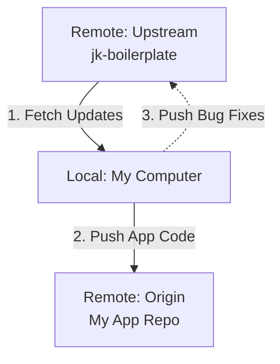

# JK Boilerplate 프레임워크 가이드

**JK Boilerplate** 문서에 오신 것을 환영합니다. 이 프로젝트는 장기 실행 서비스를 포함하여 확장 가능하고 유지 관리하기 쉬운 애플리케이션을 구축하기 위해 설계된 범용 Python 애플리케이션 프레임워크입니다.

---

## 📚 목차

1.  [시작하기](#시작하기)
2.  [아키텍처](#아키텍처)
3.  [설정 가이드](#설정-가이드)
4.  [개발 가이드](#개발-가이드)
5.  [Git 워크플로우 가이드](#git-워크플로우-가이드)

---

## 🚀 주요 기능

- **통합 CLI**: `Typer`로 구축되어 간편한 명령줄 상호 작용 제공.
- **현대적인 설정 관리**: `Pydantic Settings`를 사용하여 견고하고 타입 안전한 설정 관리.
- **구조화된 로깅**: `Loguru`가 통합되어 아름답고 유익한 로그 제공.
- **모듈식 설계**: 관심사의 명확한 분리 (Core, Services, Utils).
- **내장 통합**: Supabase 및 Telegram 지원 포함.

---

# 시작하기

이 가이드는 앱 템플릿 프로젝트를 설정하고 실행하는 방법을 안내합니다.

## 필수 조건

- Python 3.9 이상
- [uv](https://github.com/astral-sh/uv) (의존성 관리에 권장됨)

## 설치

1.  **저장소 복제:**
    ```bash
    git clone <repository-url>
    cd jk-boilerplate
    ```

2.  **uv를 사용하여 의존성 설치:**
    ```bash
    # uv가 설치되어 있지 않은 경우 설치
    curl -LsSf https://astral.sh/uv/install.sh | sh

    # 가상 환경 생성 및 의존성 설치
    uv venv
    uv pip install -e .
    ```

## 설정

1.  **`.env` 파일 생성:**
    예제 파일을 복사하여 로컬 설정을 생성합니다.
    ```bash
    cp .env.example .env
    ```

2.  **`.env` 수정:**
    `.env` 파일을 열어 설정을 구성합니다 (자세한 내용은 [설정 가이드](#설정-가이드) 참조).

## 사용법

이 프로젝트는 `app`이라는 주요 진입점이 있는 통합 CLI를 사용합니다.

### 애플리케이션 실행

장기 실행 애플리케이션(예: 트레이딩 봇 또는 서버)을 시작하려면:

```bash
uv run app <app-name> --env <env>
```

- **예시:**
  ```bash
  uv run app my-app --env dev
  ```


### 도움말 확인

언제든지 사용 가능한 명령어와 옵션을 확인할 수 있습니다:

```bash
uv run app --help

```

---

# 아키텍처

이 프로젝트는 확장성과 유지 보수성을 위해 설계된 모듈식 `src-layout` 구조를 따릅니다.

## 디렉토리 구조

```
.
├── app/                 # 메인 패키지
│   ├── core/            # 비즈니스 로직 (앱 및 배치)
│   ├── utils/           # 공통 유틸리티 및 설정
│   └── main.py          # CLI 진입점
├── docs/                # 문서
├── tests/               # 테스트 스위트
├── pyproject.toml       # 프로젝트 메타데이터 및 의존성
└── README.md            # 빠른 시작 가이드
```

## 핵심 컴포넌트

### 1. CLI 진입점 (`app/main.py`)
애플리케이션의 진입점입니다. `Typer`를 사용하여 명령어를 정의하고 적절한 코어 모듈로 실행을 라우팅합니다.
- `run_app`: 장기 실행 애플리케이션을 처리합니다.

### 2. 코어 로직 (`app/core/`)
실제 비즈니스 로직을 포함합니다. 각 앱의 구현체가 위치합니다.

### 3. 유틸리티 (`app/utils/`)
애플리케이션 전반에서 사용되는 공유 리소스 및 베이스 클래스입니다.
- **App (`app.py`)**: 장기 실행 프로세스의 베이스 클래스입니다.
- **Config (`config.py`)**: `Pydantic Settings`를 사용하여 애플리케이션 설정을 관리합니다.
- **Logger (`logger.py`)**: 로깅을 위해 `Loguru`를 설정합니다.
- **Services**:
    - `supabase.py`: Supabase와 상호 작용하기 위한 클라이언트입니다.
    - `telegram.py`: 텔레그램 알림을 보내기 위한 클라이언트입니다.

## 설계 원칙

- **관심사 분리**: 비즈니스 로직은 인프라 코드(설정, 로깅, 외부 서비스)와 분리됩니다.
- **의존성 주입**: 설정과 서비스는 필요한 곳에서 import되어 모듈성을 높입니다.
- **타입 안전성**: Python 타입 힌트와 Pydantic 모델을 광범위하게 사용합니다.

---

# 설정 가이드

이 프로젝트는 견고한 설정 관리를 위해 **Pydantic Settings**를 사용합니다. 환경 변수 및 `.env` 파일에서 설정을 읽는 것을 지원합니다.

## `.env` 파일

`.env` 파일은 다양한 환경(로컬, 개발, 운영)에 대해 애플리케이션을 설정하는 주요 방법입니다.

**`.env` 예시:**
```ini
LOG_LEVEL=INFO

# Telegram
TELEGRAM_TOKEN=123456:ABC-DEF1234ghIkl-zyx57W2v1u123ew11
TELEGRAM_CHAT_ID=123456789

# Supabase
SUPABASE_URL=https://xyz.supabase.co
SUPABASE_KEY=eyJhbGciOiJIUzI1NiIsInR5cCI6IkpXVCJ9...
SUPABASE_KEY=eyJhbGciOiJIUzI1NiIsInR5cCI6IkpXVCJ9...
```

### Supabase 테이블 생성

앱 생명주기 로깅을 위해 Supabase에 `app_events` 테이블을 생성해야 합니다. 다음 SQL을 SQL Editor에서 실행하세요:

```sql
-- Create the app_events table
create table public.app_events (
  id bigint generated by default as identity primary key,
  created_at timestamp with time zone default timezone('utc'::text, now()) not null,
  app_name text not null,
  env text not null,
  event_type text not null,
  payload jsonb default '{}'::jsonb
);

-- Set up Row Level Security (RLS)
alter table public.app_events enable row level security;

-- Create an index for faster querying by app_name and created_at
create index app_events_app_name_idx on public.app_events (app_name);
create index app_events_created_at_idx on public.app_events (created_at);
```

## 설정 클래스 (`app/utils/config.py`)

설정은 `app/utils/config.py`에 Pydantic 모델로 정의되어 있습니다.

```python
class AppConfig(BaseSettings):
    env: str = "dev"
    name: str = "jk-boilerplate"
    
    # 중첩된 설정
    telegram: TelegramConfig
    supabase: SupabaseConfig
    
    # ...
```

## 코드에서 설정 접근하기

전역 `config` 인스턴스를 import하여 코드 어디에서나 설정에 접근할 수 있습니다.

```python
from app.utils.config import config

def my_function():
    print(f"Running in {config.env} environment")
    if config.telegram.token:
        # ...
```

---

# 개발 가이드

이 가이드는 새로운 애플리케이션과 배치 작업을 추가하여 프레임워크를 확장하는 방법을 설명합니다.

## 새로운 애플리케이션 추가

### 방법 A: 스크립트 사용 (권장)

`scripts/create_app.sh` 스크립트를 사용하면 보일러플레이트 코드를 자동으로 생성할 수 있습니다.

```bash
# 실행 권한 부여 (최초 1회)
chmod +x scripts/create_app.sh

# 앱 생성
./scripts/create_app.sh my-new-app
```

스크립트가 실행되면 `app/core/my_new_app.py` 파일이 생성되고, `app/main.py`에 추가해야 할 코드가 출력됩니다.

### 방법 B: 수동 생성

1.  **App 클래스 생성**:
    `app/core/`에 새 파일(예: `my_new_app.py`)을 생성하고 클래스를 정의합니다.
    ```python
    # app/core/my_new_app.py
    from app.utils.logger import logger

    class MyNewApp:
        def run(self):
            logger.info("My New App is running!")
            # 여기에 로직 작성
    ```

2.  **CLI에 등록**:
    `app/main.py`의 `run_app` 함수에 새 앱을 포함하도록 업데이트합니다.
    ```python
    # app/main.py
    def run_app(app_name: str, ...):
        # ...
        if app_name == "my-new-app":
            from app.core.my_new_app import MyNewApp
            MyNewApp().run()
        # ...
    ```

3.  **실행**:
    ```bash
    uv run app my-new-app --env dev
    ```


## 새로운 의존성 추가

새로운 Python 라이브러리를 추가하려면 `pyproject.toml`을 업데이트하거나 `uv`를 사용하세요:

```bash
uv pip install <package_name>
# 그 후 pyproject.toml을 수동으로 업데이트하여 추적
```
# 그 후 pyproject.toml을 수동으로 업데이트하여 추적
```

---

# 상세 기능 명세

이 섹션에서는 프레임워크의 주요 기능에 대한 상세한 동작 방식을 설명합니다.

## 1. 로깅 시스템 (Logging)

`Loguru`를 기반으로 하며, 콘솔 출력과 파일 저장을 동시에 지원합니다.

- **콘솔 출력**:
    - 컬러 포맷 지원 (시간, 레벨, 파일명, 라인 등 표시)
    - `LOG_LEVEL` 설정에 따라 출력 레벨 제어 (기본값: `INFO`)
- **파일 저장**:
    - **경로**: `logs/` 디렉토리
    - **파일명**: `{app_name}_{YYYYMMDD}.log` (예: `my-app_20251122.log`)
    - **로테이션**: 매일 자정(00:00)에 새로운 파일로 교체됩니다. 즉, **로그 파일 이름은 하루에 한 번씩 날짜가 바뀌며 생성됩니다.**
    - **보존 기간**: 30일이 지난 로그 파일은 자동으로 삭제됩니다.

## 2. 설정 관리 (Configuration)

`Pydantic Settings`를 사용하여 환경 변수와 `.env` 파일을 로드합니다.

- **우선순위**:
    1.  CLI 인자 (가장 높음)
    2.  환경 변수 (OS Environment)
    3.  `.env` 파일
    4.  기본값 (Default)
- **주요 설정**:
    - `env`: 실행 환경 (`dev`, `prod` 등). CLI `--env` 옵션으로 필수 입력.
    - `name`: 앱 이름. CLI 인자(`app_name`)로 자동 설정됨.
    - `log_level`: 로깅 레벨 (`DEBUG`, `INFO`, `WARNING`, `ERROR`).

## 3. 앱 생명주기 관리 (Lifecycle)

애플리케이션의 시작과 종료를 추적하고 기록합니다.

- **이벤트 기록**: `start`, `stop`, `abnormal_stop` (에러 발생 시)
- **저장소**: Supabase `app_events` 테이블
- **알림**: 텔레그램으로 시작/종료/에러 알림 전송 (설정된 경우)

## 4. CLI (Command Line Interface)

`Typer`를 사용하여 직관적인 명령줄 인터페이스를 제공합니다.

- **명령어 구조**: `uv run [COMMAND] [ARGS] [OPTIONS]`
- **필수 옵션**: `--env` 옵션은 모든 명령어에서 필수입니다. 이는 실수로 운영 환경(`prod`)에서 개발 코드를 실행하는 것을 방지하기 위함입니다.

## 5. 텔레그램 알림 (Telegram Notifications)

애플리케이션의 상태 변화나 중요 이벤트를 텔레그램으로 실시간 전송합니다.

- **설정**: `.env` 파일에 `TELEGRAM_TOKEN`과 `TELEGRAM_CHAT_ID`가 설정되어 있어야 작동합니다. 설정이 없으면 초기화 단계에서 경고 로그를 남기고 기능은 비활성화됩니다.
- **동기/비동기 지원**:
    - `send_message(msg)`: `async` 함수로, 비동기 컨텍스트에서 사용합니다.
    - `send_sync(msg)`: 동기 함수로, 일반적인 코드에서 사용합니다. 내부적으로 이벤트 루프를 감지하여 적절하게 처리합니다.
- **자동 알림**:
    - 앱 시작 시 (`🚀 App Started`)
    - 앱 정상 종료 시 (`🏁 App Stopped`)
    - 예외 발생 시 (`🚨 App Failed: ...`)

---

# Git 워크플로우 가이드

이 섹션은 **"공통 프레임워크(Boilerplate)"**를 기반으로 **"개별 애플리케이션(App)"**을 개발할 때, 소스 코드를 효율적으로 관리하는 Git 전략을 설명합니다.

## 1. 아키텍처 및 데이터 흐름

개발자는 두 개의 원격 저장소(Remote)와 상호작용합니다.

1.  **Upstream (`jk-boilerplate`)**: 공통 프레임워크 원본. (Read-Only에 가까움)
2.  **Origin (`my-app`)**: 내가 개발 중인 실제 서비스 저장소. (Read/Write)

### 데이터 흐름도



## 2. 실전 가이드 (Step-by-Step)

새로운 프로젝트를 시작하는 시점부터 차근차근 진행합니다.

### 1단계: 프로젝트 초기화 (Clone & Setup)

먼저 보일러플레이트 코드를 내려받아 내 프로젝트의 시작점으로 삼습니다.

```bash
# 1. 보일러플레이트 Clone (내 앱 이름으로 폴더 생성)
git clone https://github.com/taein2301/jk-boilerplate.git my-awesome-app

# 2. 폴더 이동
cd my-awesome-app

# 3. 기존 원격 저장소(origin)의 이름을 upstream으로 변경
# (이제 jk-boilerplate는 'upstream'이라고 부릅니다)
git remote rename origin upstream

# 4. 내 앱을 위한 새로운 원격 저장소 연결
# (Github에 미리 빈 저장소를 생성해두어야 합니다)
git remote add origin https://github.com/my-account/my-awesome-app.git

# 5. 설정 확인
git remote -v
# origin   https://github.com/my-account/my-awesome-app.git (fetch/push)
# upstream https://github.com/taein2301/jk-boilerplate.git (fetch/push)
```

### 2단계: 프레임워크 업데이트 반영 (Sync)

`jk-boilerplate`에 새로운 기능이나 보안 패치가 나왔을 때, 내 앱에 적용하는 방법입니다.

```bash
# 1. Upstream의 최신 변경사항 가져오기
git fetch upstream

# 2. 내 로컬 브랜치(main)에 병합(Merge)
git merge upstream/main
```
*참고: `main` 브랜치에서 작업 중이었다면 충돌(Conflict)이 발생할 수 있습니다. 이는 정상적인 과정이며, 충돌난 파일을 수정하고 커밋하면 됩니다.*

### 3단계: 프레임워크 버그 수정 및 기여 (Contribute)

앱 개발 중에 프레임워크 자체의 버그(`core/`나 `utils/` 등)를 발견했습니다. 이를 수정해서 Upstream에 다시 기여하는 방법입니다.
**핵심은 내 앱의 비즈니스 로직이 섞이지 않게 하는 것입니다.**

**방법 A: Git Worktree 사용 (권장)**
물리적으로 폴더를 분리하여 실수할 여지를 없앱니다.

```bash
# 1. 상위 폴더에 'boilerplate-fix'라는 이름으로 순정 브랜치(upstream/main)를 체크아웃
git worktree add ../boilerplate-fix upstream/main

# 2. 해당 폴더로 이동
cd ../boilerplate-fix

# 3. 버그 수정 및 Push
# (이 폴더에는 내 앱 소스가 없으므로 안심하고 Push 가능)
git commit -am "Fix: critical bug in utils"
git push upstream HEAD:main

# 4. 작업 폴더 삭제 (선택)
cd ../my-awesome-app
git worktree remove ../boilerplate-fix
```

**방법 B: 브랜치 분리 사용**
하나의 폴더에서 브랜치만 바꿔서 작업합니다.

```bash
# 1. 순정 브랜치 생성 및 이동
git checkout -b fix/core-bug upstream/main

# 2. 버그 수정 및 Push
git commit -am "Fix: critical bug in utils"
git push upstream HEAD:main

# 3. 다시 내 앱 브랜치로 복귀
git checkout main
```

## 3. 요약

| 명령어 | 설명 |
| :--- | :--- |
| `git remote rename origin upstream` | 기존 연결을 Upstream(원본)으로 변경 |
| `git remote add origin <URL>` | 내 새 저장소를 Origin(메인)으로 등록 |
| `git pull upstream main` | 프레임워크 업데이트 받기 |
| `git push origin main` | 내 앱 저장하기 |
| `git push upstream main` | **주의!** 프레임워크 원본에 수정사항 반영하기 |

---

## 4. FAQ: Git Submodule은 어떤가요?

"하나의 레포 안에 또 다른 레포를 넣는 방법"으로 `git submodule`이 있습니다. 하지만 **보일러플레이트(Boilerplate) 용도로는 추천하지 않습니다.**

### 비교 분석

| 방식 | 설명 | 장점 | 단점 (보일러플레이트 관점) |
| :--- | :--- | :--- | :--- |
| **Upstream Remote** (추천) | 내 앱이 곧 보일러플레이트의 확장판임. (`git merge`로 합침) | 구조가 단순함. 파일을 직접 수정하고 합치기 쉬움. | 앱 코드와 보일러플레이트 코드가 같은 폴더에 섞임. |
| **Git Submodule** | 내 앱 폴더 안에 `jk-boilerplate` 폴더가 별도로 존재함. | 완벽한 격리. 특정 버전을 고정하기 좋음. | **치명적**: 보일러플레이트의 `main.py`나 설정을 내 입맛대로 고치기 매우 어려움. 파일 경로가 바뀜. |

### 결론
*   **라이브러리/플러그인**을 가져다 쓰는 경우라면 `Submodule`이 좋습니다. (예: 공용 UI 컴포넌트 라이브러리)
*   **기초 뼈대(Boilerplate)**로 시작해서 살을 붙이는 경우라면 **Upstream Remote** 방식이 표준입니다. 뼈대 자체를 수정해야 할 일이 많기 때문입니다.

